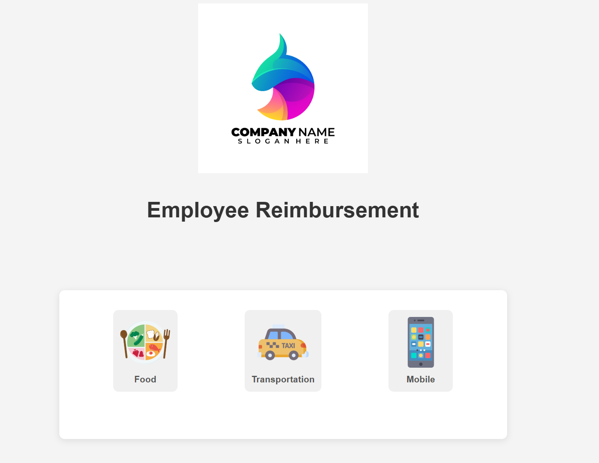

### The frontend is in the `frontend` directory, and the backend is in the `backend` directory. The frontend is a Flask app that serves the web interface, and the backend is a Flask API that handles data submission.

Before running the app, please make sure to:

Provide Logo and Icon Images: Replace "company_logo.png", "food_icon.png", "transport_icon.png", and "mobile_icon.png" in index.html with the actual paths to your logo and icon images.

Set Environment Variables: Set the following environment variables with your PostgreSQL database credentials:

>- export PGHOST=Your database host
>- export PGPORT=Your database port
>- export PGUSER=Your database username
>- export PGPASSWORD=Your database password
>- export PGDATABASE=Your database name

Create Database Table: Create the **reimbursements** table in your PostgreSQL database with the following columns:

1. name (text)
2. date (date)
3. time (time)
4. amount (numeric)
5. reason (text)
6. category (text)
7. restaurant_name (text)
8. destination (text)
9. distance (numeric)

-- Connect to your PostgreSQL database
<code>
psql -d your_database_name
</code>

-- Create the reimbursements table
<code>
CREATE TABLE reimbursements (
    id SERIAL PRIMARY KEY,
    name VARCHAR(255) NOT NULL,
    date DATE NOT NULL,
    time TIME NOT NULL,
    amount NUMERIC(10, 2) NOT NULL,
    reason TEXT NOT NULL,
    category VARCHAR(50) NOT NULL,
    restaurant_name VARCHAR(255),
    destination VARCHAR(255),
    distance NUMERIC(10, 2)
);
</code>

Install Libraries: Make sure you have the psycopg2 and Flask libraries installed (pip install psycopg2 Flask).

To run the frontend, navigate to the `frontend` directory and run `python app.py`. The frontend will be accessible at port 5000.

To run the backend, navigate to the `backend` directory and run `python app.py`. The backend API will be accessible at port 5001.
